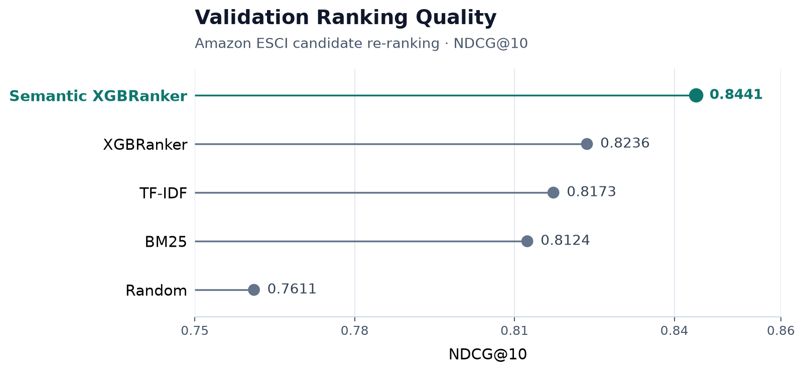
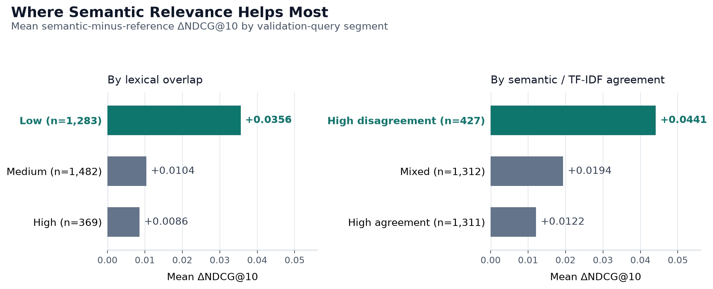
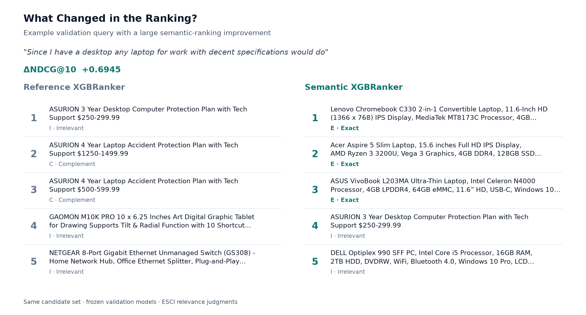

# Product Search & Ranking Platform

An e-commerce **candidate re-ranking** project on Amazon Science's Shopping Queries (ESCI) dataset. The modeling path is incremental: **BM25 / TF-IDF → XGBoost learning-to-rank → semantic augmentation**. Adding pretrained query-title similarity improved validation **NDCG@10 from 0.8236 to 0.8441**, with the largest gains when lexical evidence was weak.

> **Scope:** ESCI supplies the candidate set. This project evaluates candidate re-ranking rather than full-catalog retrieval.

**Stack:** Python · pandas · scikit-learn · XGBoost · Sentence Transformers · Matplotlib



## Results at a glance

| Model                  |    NDCG@10 |  Recall@10 |        MRR |
| ---------------------- | ---------: | ---------: | ---------: |
| Random                 |     0.7611 |     0.5684 |     0.8757 |
| BM25                   |     0.8124 |     0.5906 |     0.8988 |
| TF-IDF                 |     0.8173 |     0.5922 |     0.9060 |
| XGBRanker              |     0.8236 |     0.5929 |     0.9089 |
| **Semantic XGBRanker** | **0.8441** | **0.6086** | **0.9277** |

Semantic XGBRanker vs. the reference XGBRanker on **3,134 validation queries**, using **2,000 paired bootstrap replicates**. The official ESCI test set was left untouched.

```text
Mean ΔNDCG@10:     +0.0205
Median ΔNDCG@10:   +0.0036

Improved queries:   1,677
Regressed queries:  1,205
Ties:                 252

Paired bootstrap 95% CI:
[0.0173, 0.0236]
```

The interval lies entirely above zero.

## What I built

```text
Amazon ESCI candidate sets
        ↓
BM25 / TF-IDF
        ↓
lexical + structured ranking features
        ↓
XGBRanker
        ↓
+ query-title semantic similarity
        ↓
Semantic XGBRanker
        ↓
paired evaluation + diagnostics
```

Semantic relevance was added as **one new ranking signal** to the existing model so its incremental value could be measured against a fixed reference ranker. It does not replace lexical relevance.

## Where semantic relevance helps



Observed validation gains were largest in two segments:

```text
Low relevant-title lexical overlap:   +0.0356 mean ΔNDCG@10
High semantic / TF-IDF disagreement:  +0.0441 mean ΔNDCG@10
```

Semantic similarity added the most value when lexical matching was weak or when semantic and TF-IDF signals ranked candidates differently. These are observational diagnostics on the frozen validation set, not causal claims.

## What changed in the ranking?



On the validation query *"Since I have a desktop any laptop for work with decent specifications would do"*, the reference top results were dominated by protection plans and unrelated products. The semantic ranker moved three Exact laptop matches into positions 1–3. Query-level **ΔNDCG@10 was +0.6945**. Both models ranked the same ESCI candidate set.

This is an illustrative large-improvement example, not a typical query.

## Modeling approach

### Lexical baselines

Random, BM25, and TF-IDF rerank only the candidate products ESCI already provides for each query.

### Learning-to-rank

The reference **XGBRanker** (`objective = rank:ndcg`, 200 trees) uses ten features:

```text
bm25_score
tfidf_score
shared_token_count
query_token_coverage
title_token_coverage
exact_query_in_title
brand_match
title_token_count
token_length_difference
query_bullet_coverage
```

Validation NDCG@10: **0.8236**.

Controlled ablations showed that the improvement over TF-IDF was not explained by simply combining BM25 and TF-IDF; overlap and coverage features provided additional ranking information. Full ablation analysis is in `notebooks/02_learning_to_rank_analysis.ipynb`.

### Semantic augmentation

Query-title similarity is computed with a frozen `sentence-transformers/all-MiniLM-L6-v2` encoder. Embeddings are L2-normalized; the score is cosine similarity.

The semantic ranker adds one feature, `semantic_similarity`, for **11 features total**. There was no transformer fine-tuning and no embedding-model sweep.

## Feature importance

| Rank | Feature               | Gain importance |
| ---: | --------------------- | --------------: |
|    1 | semantic_similarity   |          0.2633 |
|    2 | tfidf_score           |          0.2607 |
|    3 | query_token_coverage  |          0.1809 |
|    4 | query_bullet_coverage |          0.0531 |
|    5 | brand_match           |          0.0380 |

Gain importance shows that the fitted trees used semantic similarity heavily, but it should not be interpreted as causal or unique feature importance.

## Evaluation discipline

```text
Train:        356,615 candidates · 17,754 queries
Validation:    63,038 candidates ·  3,134 queries
```

- Split is by `query_id`; train/validation query overlap is 0.
- All products for a query stay in one partition.
- Reference and semantic models are compared on the same validation candidate set.
- Metrics are computed per query, then aggregated.
- Model differences use paired query-level bootstrap resampling.
- The official ESCI test holdout remains untouched.

## Relevance labels

| Label | Meaning    | Gain |
| ----- | ---------- | ---: |
| E     | Exact      |    3 |
| S     | Substitute |    2 |
| C     | Complement |    1 |
| I     | Irrelevant |    0 |

NDCG uses graded relevance. Recall@10 and MRR treat E and S as relevant.

## Dataset and data integrity

The project uses the [Amazon Science Shopping Queries Dataset (ESCI)](https://github.com/amazon-science/esci-data), restricted to `small_version == 1` and the U.S. locale. Examples join product metadata on `(product_id, product_locale)`. The raw dataset is not redistributed.

Expected local files:

```text
data/raw/shopping_queries_dataset_examples.parquet
data/raw/shopping_queries_dataset_products.parquet
```

The pipeline checks product-key uniqueness, join cardinality, row preservation, duplicate query-product candidates, conflicting labels, and query-split integrity. Violations fail the run rather than being silently repaired.

## Notebooks

```text
notebooks/
├── 01_data_and_baseline_analysis.ipynb
├── 02_learning_to_rank_analysis.ipynb
└── 03_semantic_relevance_analysis.ipynb
```

`01` covers lexical baselines, `02` learning-to-rank and ablation, and `03` semantic evaluation and diagnostics.

## Reproduce

```bash
python -m venv .venv
source .venv/bin/activate
pip install -r requirements.txt
```

Lexical and learning-to-rank workflow:

```bash
python -m scripts.prepare_data
python -m scripts.run_baseline
python -m scripts.build_features
python -m scripts.train_ranker
python -m scripts.evaluate_ranker
python -m scripts.analyze_ranker
```

Semantic feature generation uses a separate dependency environment:

```bash
pip install -r requirements-semantic.txt
python -m scripts.build_semantic_features --extract-inputs
```

The full embedding pass was run on a Colab GPU. See:

```text
artifacts/semantic_handoff/COLAB.md
```

After the semantic feature artifacts are available:

```bash
python -m scripts.build_semantic_ltr_features
python -m scripts.train_semantic_ranker
python -m scripts.evaluate_semantic_ranker
python -m scripts.analyze_semantic_ranker
```

```bash
python -m pytest -q
```

## Repository structure

```text
src/
├── data/
├── retrieval/
├── features/
├── ranking/
└── evaluation/

scripts/
notebooks/
artifacts/
tests/
docs/images/
```

Reusable logic lives in `src/`; scripts orchestrate reproducible workflows; notebooks focus on interpretation and presentation.

## Current scope and limitations

This project is candidate re-ranking on ESCI-provided candidate sets. It does not include:

- full-catalog candidate generation
- ANN / vector retrieval
- hybrid lexical + dense retrieval
- personalization
- online experimentation
- production serving

Reported numbers are offline validation results.

## Next direction

A natural extension is to move upstream from reranking into candidate generation:

```text
query
  ↓
lexical + dense candidate retrieval
  ↓
candidate set
  ↓
current learned reranker
```

That would let retrieval quality and ranking quality be evaluated separately, instead of treating the ESCI candidate set as given.

## Citation

```text
Reddy, C. K., Màrquez, L., Valero, F., Rao, N., Zaragoza, H.,
Bandyopadhyay, S., Biswas, A., Xing, A., and Subbian, K. (2022).

Shopping Queries Dataset:
A Large-Scale ESCI Benchmark for Improving Product Search.
```

Dataset: https://github.com/amazon-science/esci-data
